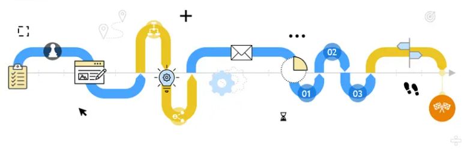
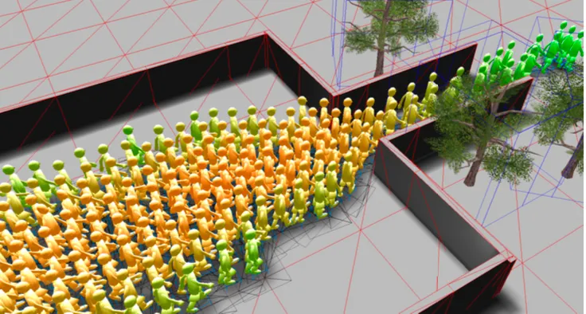








# Introduction

Data Engineer with experience in designing, building, and optimizing data pipelines and warehouse solutions. Skilled in Python, SQL, Azure Data Lake, Power BI, and ETL development. Experienced in applying machine learning models for predictive analytics and process optimization, bridging data engineering with data science. Passionate about scalable data architectures, performance optimization, and transforming complex data into actionable insights.

# 🔥 News

- *2025.06*: &nbsp;🎉🎉 Start my master's thesis at TUM, focusing on **process mining and deep learning**
- *2024.11*: &nbsp;🎉🎉 Begin working as a **Working Student** Data Engineer at MARTIN GmbH für Umwelt- und Energietechnik
- *2024.06*: &nbsp;🎉🎉 Start as a **Research Assistant** at SAP UCC München
- *2023.10*: &nbsp;🎉🎉 Commenced Master of Science studies in Robotics, Cognition und Intelligence at Technische Universität München
- *2023.07*: &nbsp;🎉🎉 Awarded Bachelor of Science degree in Chemistry from Technische Universität Clausthal
- *2022.10*: &nbsp;🎉🎉 Awarded the **Deutschlandstipendium (German National Scholarship)** at TU Clausthal

# 📖 Educations

- *2023.10 - present*: Technische Universität München  Major: M.Sc. Robotics, Cognition und Intelligence
- *2021.04 - 2023.07*: Technische Universität Clausthal  Major: Chemistry

# 💻 Work Experience

- *2024.11 - Present*： Working Student Data Engineer,  MARTIN GmbH für Umwelt- und Energietechnik , Germany
- *2024.06 - 2025.03*： Student Research Assistant,  SAP UCC München, Germany
- *2023.04 - 2023.07*： Student Teaching Assistant, Technische Universität Clausthal, Germany

# 📝 Project

  <a class="project-row" href="/projects/MA.html" target="_blank">
    
    
Master Thesis: Graph-Aware Next Event Prediction via GNN-Augmented Large Language Models

  </a>
  <a class="project-row" href="/projects/sap.html" target="_blank">
    
    
Purchase-to-Pay Process

  </a>
  <a class="project-row" href="/projects/data-engineering.html" target="_blank">
    
    
Supermarket data analysis case

  </a>
  <a class="project-row" href="/projects/mlcms.html" target="_blank">
    
    
Machine Learning in Crowd Modelling and Simulation

  </a>

# 📑 Certificates

- Microsoft Certified: Power BI Data Analyst Associate
- SQL Fundamental

