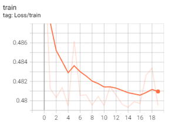
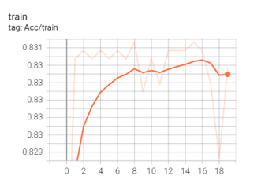

<!-- 顶部导航栏，只保留主页按钮 -->

  <a href="/about.html" style="color:#fff; font-size:1.3em; font-weight:bold; text-decoration:none;">&#8962; Homepage</a>

**Time:** **June 2025 - present**  
**Location:** **Munich, Germany**

# Master Thesis: Graph-Aware Next Event Prediction via GNN-Augmented Large Language Models

# Background

Process mining is a discipline that sits at the intersection of data science and business process management. It aims to discover, monitor, and improve real processes by extracting knowledge from event logs readily available in today's information systems.

In business processes, predicting the next activity is crucial for proactive decision-making, resource allocation, and process optimization. While people often expect process flows to be straightforward and linear, reality is much more complex. Unexpected events, deviations, and exceptions frequently occur, making accurate next event prediction both challenging and valuable. In practice, the idealized process—a simple, linear progression—is rarely observed. Instead, actual processes are full of twists, turns, and unpredictability, reflecting the gap between expectation and reality.

<!-- Insert a process mining overview illustration here -->

---
# Project Overview: Next Event Prediction with LLM & GNN
This project aims to advance next event prediction in business processes by leveraging the complementary strengths of Large Language Models (LLMs) and Graph Neural Networks (GNNs). In complex business environments, event logs contain rich semantic information—such as activity names, descriptions, and contextual data—as well as intricate structural relationships between events.

  

LLMs are employed to extract and understand the semantic content embedded in event logs, capturing nuanced meanings, dependencies, and contextual cues that traditional models may overlook. Meanwhile, GNNs are utilized to model the underlying process structure, learning from the graph-based relationships and dependencies among activities, cases, and resources.

By integrating LLMs and GNNs, the project seeks to build a unified predictive framework that can simultaneously reason about both semantic and structural aspects of business processes. This approach enables more accurate and robust predictions of the next activity, even in the presence of process deviations, exceptions, and complex event patterns. Ultimately, the goal is to provide actionable insights for process owners, supporting proactive decision-making and process optimization in dynamic, real-world scenarios.

---

# Methodology
The proposed approach integrates both semantic and structural information from business process event logs to enhance next event prediction. The methodology consists of two main branches:
<table style="width:100%; table-layout:fixed;">
  <tr>
    <td style="width:50%; vertical-align:middle; text-align:center;"></td>
    <td style="width:50%; vertical-align:middle;">Event logs contain rich textual information, such as activity names, descriptions, and contextual attributes. In this branch, advanced language models are used to process and encode these textual elements, extracting meaningful semantic representations for each event. By leveraging the capabilities of large language models, the approach can capture subtle relationships, dependencies, and patterns within the process data that may be missed by traditional methods. This enables a deeper understanding of the context and intent behind each activity, supporting more informed and accurate predictions.</td>
  </tr>
</table>

<table style="width:100%; table-layout:fixed;">
  <tr>
    <td style="width:50%; vertical-align:middle;">Beyond textual content, business processes exhibit complex structural relationships, such as the order of activities, frequency of transitions, and time intervals between events. In this branch, the event log is transformed into a graph structure, where nodes represent activities and edges capture the connections, transition frequencies, and temporal dynamics. Graph neural networks are then applied to learn from these structural dependencies, enabling the model to reason about the overall process flow, detect recurring patterns, and account for variations in process execution. This structural perspective complements the semantic information, providing a holistic view of the process for next event prediction.</td>
    <td style="width:50%; vertical-align:middle; text-align:center;"></td>
  </tr>
</table>The semantic and structural representations are then combined and fed into a unified predictive framework. This architecture allows the model to reason jointly about process semantics and structure, supporting more accurate and robust next event predictions.
---

# Results & Discussion

### Current Training Progress
The model is under active development. Initial training runs focus on validating the joint representation learning (semantic + structural). Below are the core metrics being tracked:

<table class="phase-table">
  <thead>
    <tr>
      <th style="width:30%;">Phase</th>
      <th style="width:45%;">Objective</th>
      <th style="width:25%;">Status</th>
    </tr>
  </thead>
  <tbody>
    <tr>
      <td>Pretraining (LLM embeddings frozen)</td>
      <td>Stabilize structural branch &amp; classifier</td>
      <td>Completed initial pass</td>
    </tr>
    <tr>
      <td>Joint Fine-Tuning</td>
      <td>Align semantic + structural spaces</td>
      <td>In progress</td>
    </tr>
    <tr>
      <td>Hyperparameter Sweep</td>
      <td>Learning rate / dropout / pooling strategy</td>
      <td>Scheduled</td>
    </tr>
  </tbody>
</table>

### Loss & Accuracy Trends
The following plots will be updated iteratively as experiments progress:

  <figure style="flex:1; min-width:320px; max-width:420px; text-align:center;">
    
    <figcaption style="font-size:0.85em; margin-top:6px;">Figure 1. Training vs. validation loss (to be updated).</figcaption>
  </figure>
  <figure style="flex:1; min-width:320px; max-width:420px; text-align:center;">
    
    <figcaption style="font-size:0.85em; margin-top:6px;">Figure 2. Top-1 / Top-k accuracy curve (to be updated).</figcaption>
  </figure>

Planned evaluation metrics:
- Top-1 / Top-3 / Top-5 accuracy
- Macro / weighted F1 (for imbalanced activity spaces)

### Qualitative Error Inspection (Planned)
Mis-prediction clusters will be analyzed to see whether they stem from:
- Semantic ambiguity in activity labels
- Under-represented transition patterns in the graph
- Temporal irregularities (bursty sequences vs. long delays)
- Concept drift across different time windows

### Ablation Roadmap
Upcoming controlled comparisons will isolate the contribution of each component:
1. LLM-only baseline (no graph branch)
2. GNN-only baseline (one-hot / simple textual tokenization)
3. Full model (LLM + GNN + time + pooling strategy)

> Project Status: Ongoing. More figures, tables, and analysis will be added in the coming weeks as additional training runs complete.

