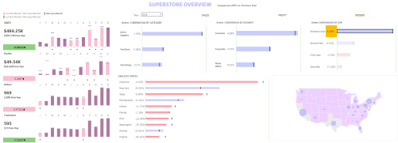

<!-- 顶部导航栏，只保留主页按钮 -->

  <a href="/about.html" style="color:#fff; font-size:1.3em; font-weight:bold; text-decoration:none;">&#8962; Homepage</a>

**Time:** **October 2023 - December 2023**  
**Location:** **Munich, Germany**

# Superstore Dashboard Analytics Case Study

## Objective
Build a single-screen executive dashboard (Tableau Superstore dataset) enabling rapid insight into sales, profit, orders, customers, product structure, and geographic performance with time comparison (current period vs prior year).

## Data Scope
Dataset: Tableau Superstore sample (Orders + Returns not used here). Core fields: Order Date, Sales, Profit, Quantity, Discount, Category, Sub-Category, Segment, Region, State, Customer ID. Aggregation: Monthly (with drill to day). Derived metrics: YoY delta, Profit Margin (Profit / Sales), Top-N contribution.

  
  
Figure: Consolidated executive dashboard (expanded full-width view).

## KPI Overview
| KPI | Interpreted Meaning | Strategic Signal (Example) |
|-----|---------------------|----------------------------|
| Sales | Gross revenue from orders | Growth health & scale |
| Profit | Absolute profitability | Margin sustainability |
| Orders | Transaction volume | Demand intensity |
| Customers | Active unique buyers | Acquisition / retention mix |
| Profit Margin | Profit / Sales | Pricing & discount discipline |

Mini trend lines show momentum; YoY color cues (e.g., green up / red down) allow instant variance scanning.

## Geographic Insights
Choropleth + proportional bubbles (State level) separate scale (bubble size) from efficiency (color / margin tooltip). High scale–low margin states become pricing / logistics review targets; low scale–high margin states become expansion candidates.

## Tableau Public (Live Dashboard)
Primary (interactive) version deployed on Tableau Public:

👉 Live Link: <a href="https://public.tableau.com/views/SuperstoreOverview_17553537670110/Super?:language=en-US&publish=yes&:sid=&:redirect=auth&:display_count=n&:origin=viz_share_link" target="_blank" rel="noopener noreferrer">Open Interactive Dashboard</a>

## Summary
The dashboard consolidates multi-dimensional retail levers (product, customer, region, time) into an actionable surface. Early findings emphasize defending margin in select furniture sub-categories, scaling profitable tech segments, and closing regional efficiency gaps while reigniting customer acquisition. Subsequent iterations will add variance decomposition, retention cohorts, and predictive modules for proactive planning.

