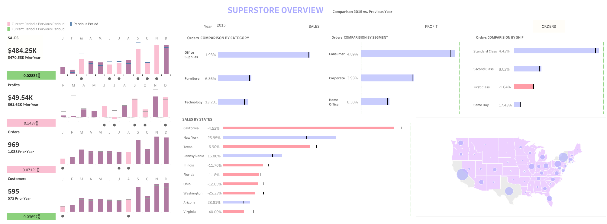

<!-- 顶部导航栏，只保留主页按钮 -->

  <a href="/about.html" style="color:#fff; font-size:1.3em; font-weight:bold; text-decoration:none;">&#8962; Homepage</a>

**Time:** **October 2023 - December 2023**  
**Location:** **Munich, Germany**

# Superstore Dashboard Analytics Case Study

## Objective
Build a single-screen executive dashboard (Tableau Superstore dataset) enabling rapid insight into sales, profit, orders, customers, product structure, and geographic performance with time comparison (current period vs prior year).

## Data Scope

  

    Dataset
    Tableau Superstore sample
  

  

    Core Fields
    Order Date · Sales · Profit · Quantity · Category · Sub-Category · Segment · Region · State · Customer ID
  

  

    Aggregation
    Year (drill to month)
  

## KPI Overview
<table class="kpi-table">
  <thead>
    <tr>
      <th>KPI</th>
      <th>Interpreted Meaning</th>
      <th>Strategic Signal (Example)</th>
    </tr>
  </thead>
  <tbody>
    <tr>
      <td>Sales</td>
      <td>Gross revenue from orders</td>
      <td>Growth health &amp; scale</td>
    </tr>
    <tr>
      <td>Profit</td>
      <td>Absolute profitability</td>
      <td>Margin sustainability</td>
    </tr>
    <tr>
      <td>Orders</td>
      <td>Transaction volume</td>
      <td>Demand intensity</td>
    </tr>
    <tr>
      <td>Customers</td>
      <td>Active unique buyers</td>
      <td>Acquisition / retention mix</td>
    </tr>
    <tr>
      <td>Profit Margin</td>
      <td>Profit / Sales</td>
      <td>Pricing &amp; discount discipline</td>
    </tr>
  </tbody>
</table>

Mini trend lines show momentum; YoY color cues (e.g., green up / red down) allow instant variance scanning.

## Geographic Insights
Choropleth combined with proportional bubbles at state level separates scale, indicated by bubble size, from efficiency, indicated by color and margin tooltip. States with high scale but low margin become pricing and logistics review targets; states with low scale but high margin become expansion candidates.

## Tableau Public (Live Dashboard)
Primary (interactive) version deployed on Tableau Public:

👉 Live Link: <a href="https://public.tableau.com/views/SuperstoreOverview_17553537670110/Super?:language=en-US&publish=yes&:sid=&:redirect=auth&:display_count=n&:origin=viz_share_link" target="_blank" rel="noopener noreferrer">Open Interactive Dashboard</a>

## Summary
The dashboard consolidates multi-dimensional retail levers (product, customer, region, time) into an actionable surface. Early findings emphasize defending margin in select furniture sub-categories, scaling profitable tech segments, and closing regional efficiency gaps while reigniting customer acquisition. Subsequent iterations will add variance decomposition, retention cohorts, and predictive modules for proactive planning.

