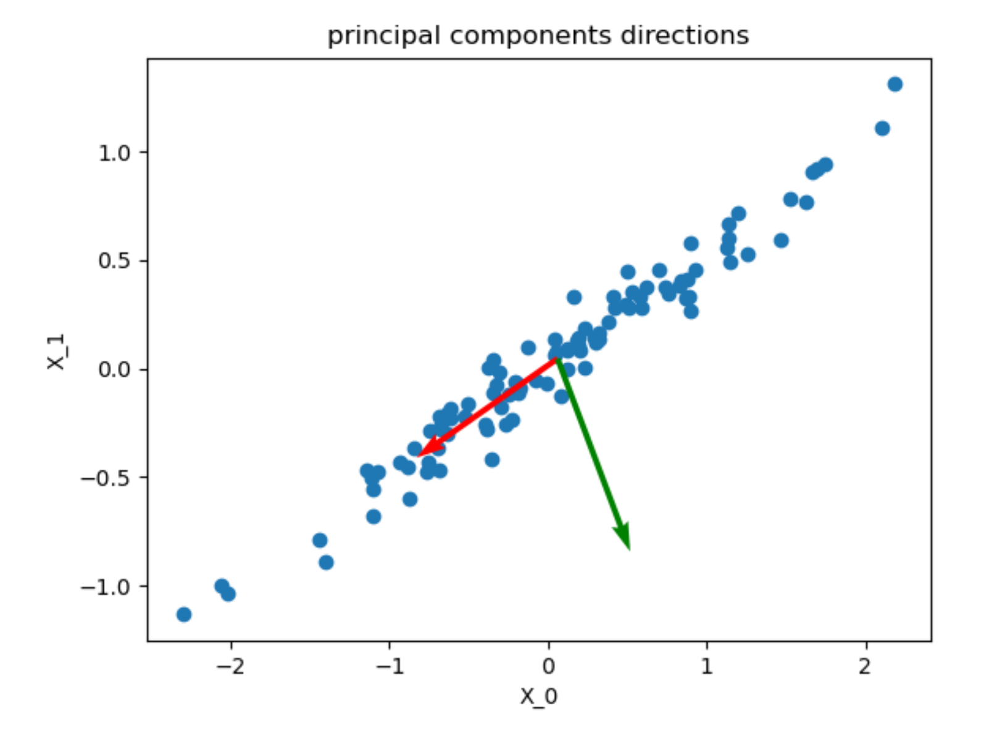
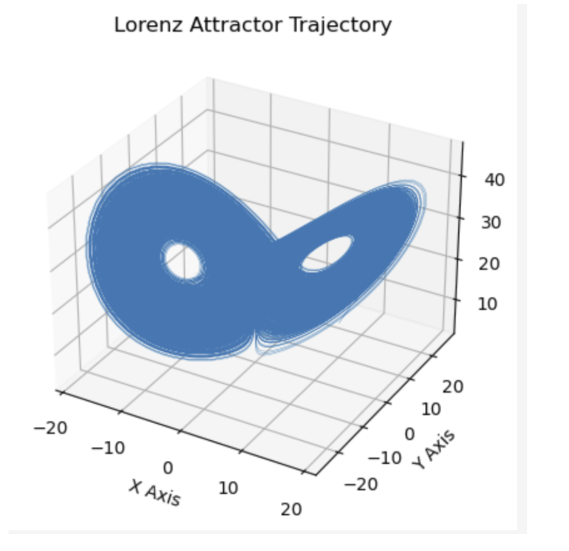

<!-- 顶部导航栏，只保留主页按钮 -->

  <a href="/about.html" style="color:#fff; font-size:1.3em; font-weight:bold; text-decoration:none;">&#8962; Homepage</a>

**Time:** March 2024 - July 2024  
**Location:** Munich, Germany

# Project Overview

The practical course consists of 6 projects, including the systematic study and implementation of algorithms related to crowd modeling, dynamic systems theory, machine learning techniques and numerical analysis of complex systems, the development of extensions to the simulation software (Vadere), the validation of models and data, and the construction of a neural network applied to the simulation results to model pedestrian movement speed.

# Project Description

  

  In our first project, we developed a crowd simulation model based on simple cellular automata, where individual components follow basic rules but collectively exhibit complex emergent behavior.

  The system was implemented from scratch in Python using the tkinter package, featuring a custom simulation environment with interactive visualization and user interfaces for configuring pedestrians, objects, and obstacles.

  To address obstacle avoidance, we integrated and compared two pathfinding approaches—Dijkstra’s algorithm and the Fast Marching Method—evaluating their efficiency in distance field computation.

  In line with RiMEA guidelines, the model was validated across multiple benchmark scenarios, including corridor movement, bottlenecks, and corner navigation.

  

  In the second project, we extended the Vadere simulation framework by integrating a new SIR (Susceptible–Infected–Recovered) model into its source code. This required modifying and rebuilding the software in Java to incorporate epidemiological dynamics into pedestrian simulations.

  After validating the core implementation, we enhanced the system with additional visualization and result-logging features. To demonstrate its applicability, we designed multiple test scenarios, including an artificial “supermarket” environment where pedestrians entered through the entrance, moved within the space, and exited after a certain period.

  
  

  In the third project, we explored methods for reducing high-dimensional data to lower-dimensional representations, focusing on Principal Component Analysis (PCA), Diffusion Maps, and Variational Autoencoders (VAEs).

  For PCA, We perform PCA on an image of a raccoon.
  This process uses truncated singular value decomposition (SVD) to reduce dimensionality, filter out noise, compress the data, and extract key features. By retaining only the most important components in the original data, this approach simplifies analysis and improves the efficiency and performance of machine learning models. Using Diffusion Maps, we approximated eigenfunctions on the Swiss roll manifold as well as on the same trajectory data applied in PCA. For the VAE, we implemented and trained models on the MNIST dataset,experimenting with different latent space dimensionalities to evaluate their impact on reconstruction quality.

  
  

  
  

    This section analyzes the behavior of nonlinear dynamical systems through bifurcation theory, focusing on cusp bifurcations where small parameter changes cause significant shifts in stability.  

    The figure illustrates four typical phase portraits:  
    - Stable node: trajectories converge monotonically to equilibrium.  
    - Stable focus: trajectories spiral inward, showing oscillatory but stable behavior.  
    - Unstable node: trajectories diverge along real eigen-directions.  
    - Unstable focus: trajectories spiral outward due to complex eigenvalues with positive real parts.  

  

  

  
  This part applies the time-delay embedding technique to reconstruct the phase space of the Lorenz attractor, a canonical chaotic system. By mapping a single time-series trajectory into a higher-dimensional space, the underlying structure and dynamics of the system become visible. This reconstruction enables the visualization and analysis of chaotic behavior, providing deeper insights into the attractor’s patterns and properties.

  

  

  In the final project, we implemented a deep neural network (DNN) to analyze pedestrian dynamics using datasets from two experimental setups: bottleneck (B) and ring (R). The preprocessed data were shuffled and split into separate training and test sets.  

  Specifically, 4 datasets were prepared for the bottleneck and 7 datasets for the ring. The split subsets were concatenated to construct aggregated training and test sets for B and R individually.  

  To further evaluate the model’s generalization ability, the datasets of B and R were merged and reshuffled to form a combined dataset R+B. This hierarchical dataset construction (individual, combined, and merged) ensured robust training and reliable performance assessment of the DNN.