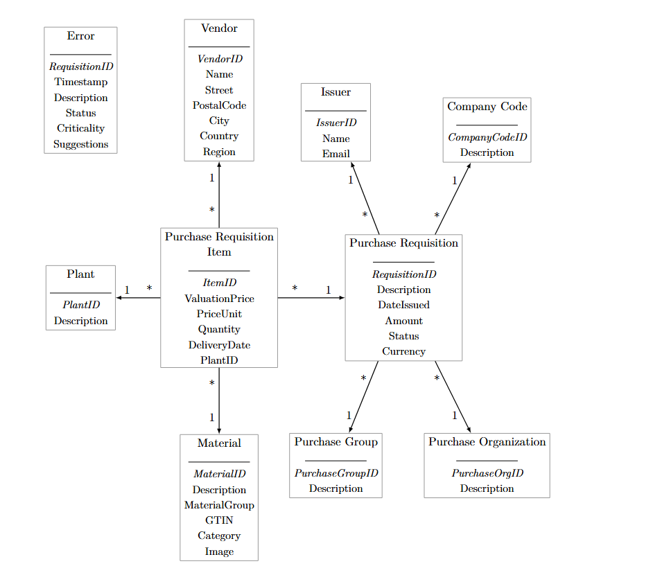
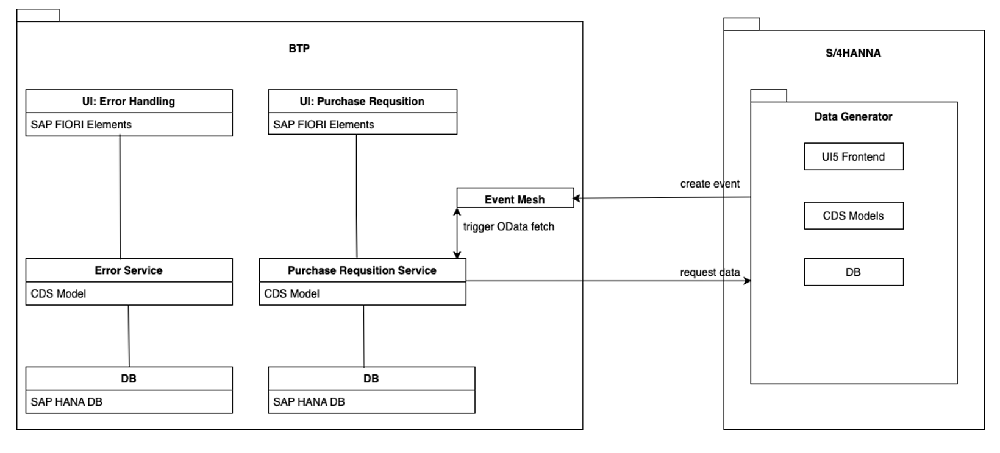
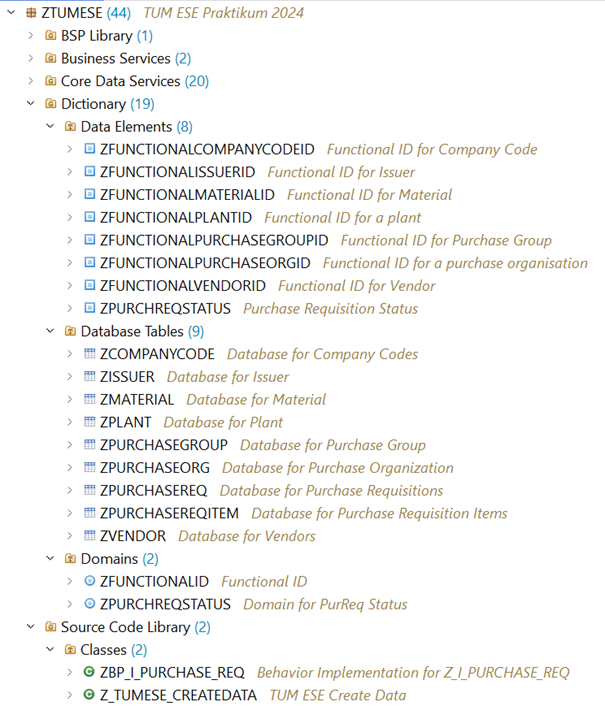
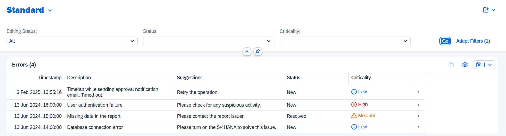

<!-- 顶部导航栏，只保留主页按钮 -->

  <a href="/about.html" style="color:#fff; font-size:1.3em; font-weight:bold; text-decoration:none;">&#8962; Homepage</a>

**Time:** October 2024 - February 2025  
**Location:** Munich, Germany

# Purchase-to-Pay Process

## Project Overview

This project enhances a real-world purchase-to-pay (P2P) process where a single Purchase Requisition (PR) manager previously approved or rejected all requests—creating workload concentration, delay risk, and error propagation. We build on an existing on‑premise solution (Purchase Requisition app + Error Handling app) rather than rewriting from scratch.

### Goals
- Increase resilience and speed in PR approval/rejection
- Provide ubiquitous access to PR & error handling
- Streamline requester notification (approval/rejection feedback loop)
- Establish a structured, faster error resolution path

## Semantic Data Model
<table style="width:100%; table-layout:fixed; margin:16px 0;">
  <tr>
    <td style="width:55%; vertical-align:middle;">
The semantic data model normalizes core procurement entities to minimize redundancy and support consistent joins in CDS views. A Purchase Requisition (header) captures business context (description, date issued, total amount, currency, status) and links to one or more line Items holding valuation price, price unit, quantity, delivery date and plant reference. Master data tables provide stable dimensions: Company Code (legal / accounting scope), Purchase Organization and Purchase Group (responsibility & sourcing structure), Plant (fulfillment location), Material (catalog attributes, category, GTIN, optional image), Vendor (location & regional segmentation), Issuer (employee / requester identity), and Error (time-stamped operational or validation issues enriched with criticality and suggestion). Cardinalities enforce business rules (e.g., one requisition—many items; one vendor—many items; one plant—many items) enabling clean aggregation, status tracking, and event emission. This structured semantic layer underpins the services, reduces transformation logic in the application layer, and enables precise filtering (by status, criticality, organization) without denormalized duplication.
    </td>
    <td style="width:45%; vertical-align:middle; text-align:center;">
      
      
ER diagram of core entities & relationships.

    </td>
  </tr>
</table>

## System Architecture

  <!-- 架构图占位：将文件命名为 p2p_architecture.png 放到 images 目录 -->
  
  
High-level component & event flow architecture.

**BTP Layer**
- UI: Purchase Requisition – Fiori Elements app for creating/reviewing PRs.
- UI: Error Handling – Fiori Elements app for surfacing & resolving technical / business errors.
- Purchase Requisition Service – CAP / CDS model exposing OData endpoints for PR data & status transitions.
- Error Service – CAP / CDS model persisting error events, classification, resolution metadata.
- Databases – Two SAP HANA schemas (logical separation for PR vs. error domain).
- Event Mesh – Central event backbone (decouples S/4HANA producers and BTP consumers; triggers incremental data fetch).

**S/4HANA System**
- Data Generator (sandbox / simulation) – UI5 frontend to seed / mutate transactional data.
- CDS Models – Expose PR domain & error-relevant artifacts as OData.
- DB – Underlying transactional persistence.
- Event Publisher – Emits domain or technical events (e.g., PR_CREATED, ERROR_DETECTED) to Event Mesh.

## ABAP Backend: Data Model & Service Layer

<table style="width:100%; table-layout:fixed;">
  <tr>
    <td style="width:45%; vertical-align:middle; text-align:center;">
      
      
ABAP repository objects

    </td>
    <td style="width:55%; vertical-align:middle;">
The ABAP backend defines semantic building blocks (data elements & domains) and normalized tables for master data (company, material, vendor, org units) plus transactional purchase requisitions (header + item). CDS views wrap these tables with joins, annotations and filtered projections for Fiori / OData consumption. A behavior implementation class enforces valid state transitions (create / approve / reject), encapsulates validations and emits lightweight events (e.g. PR_CREATED, STATUS_CHANGED) picked up by the BTP layer. A small seed class generates sample data for testing and integration, while the design separates master and transactional schemas to simplify delta fetch, keep business rules centralized, and support clean extensibility (extra status, risk score, audit trail) with minimal refactoring.
    </td>
  </tr>
</table>

## UI Screens (Results)

<figure style="margin:14px 0 30px;">
  
  <figcaption style="font-size:0.75em; margin-top:6px; color:#555; text-align:left;">(a) Error Handling app – filtered list with timestamp, description, suggested action, status & criticality badges.</figcaption>
</figure>

<figure style="margin:0 0 12px;">
  
  <figcaption style="font-size:0.75em; margin-top:6px; color:#555; text-align:left;">(b) Purchase Requisition detail – header metadata + line items with contextual approval actions.</figcaption>
</figure>

The error handling interface consolidates heterogeneous technical and business issues into a single sortable, severity‑annotated list with actionable suggestions, reducing triage time. The PR detail screen surfaces all approval‑critical attributes (org context, issuer, valuation, supplier recommendations, item breakdown) beside immediate Accept / Reject (and Faulty Accept for test scenarios) controls, shortening decision latency while preserving traceability.

